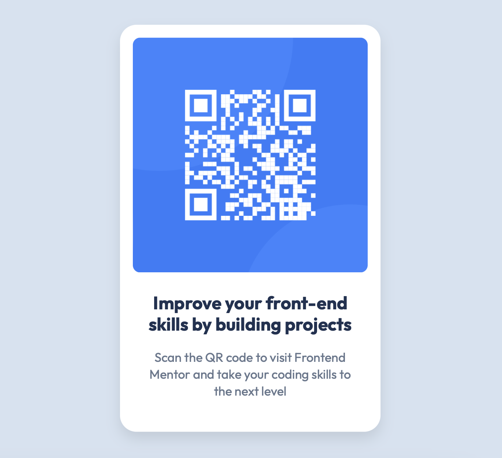

# Frontend Mentor - QR code component solution

This is a solution to the [QR code component challenge on Frontend Mentor](https://www.frontendmentor.io/challenges/qr-code-component-iux_sIO_H).

## Table of contents
- [Frontend Mentor - QR code component solution](#frontend-mentor---qr-code-component-solution)
  - [Table of contents](#table-of-contents)
  - [Overview](#overview)
    - [Screenshot](#screenshot)
    - [Links](#links)
  - [My process](#my-process)
    - [Built with](#built-with)
    - [What I learned](#what-i-learned)
    - [Continued development](#continued-development)
  - [Author](#author)

## Overview

### Screenshot

### Links

- [Solution](https://github.com/kantamana/Frontend-Mentor-qr-component)
- [Live Site](https://kantamana.github.io/Frontend-Mentor-qr-component/)

## My process

- I collaborated closely with ChatGPT throughout this challenge, which helped me validate decisions and stay on track. Experience from university coursework in computer science gave me a solid foundation in HTML, CSS, and GitHub. I also honed my CSS skills through platforms like CSS Battle and CSS Selector, which strengthened my intuition for layout and styling.

### Built with

- Simply HTML5 and CSS, no frameworks
- FlexBox

### What I learned

This challenge helped me get familiar with the conventions that make a project feel complete, such as deploying with GitHub Pages and including a clear README.

### Continued development

In the future I aspire to keep my deliverables tidy and organized, not cutting corners but keeping it proffesional. 

## Author
- Carl Emil Zeidler
- Website - [link](https://poetic-tanuki-902200.netlify.app)
- Frontend Mentor - [@kantamana](https://www.frontendmentor.io/profile/kantamana)

